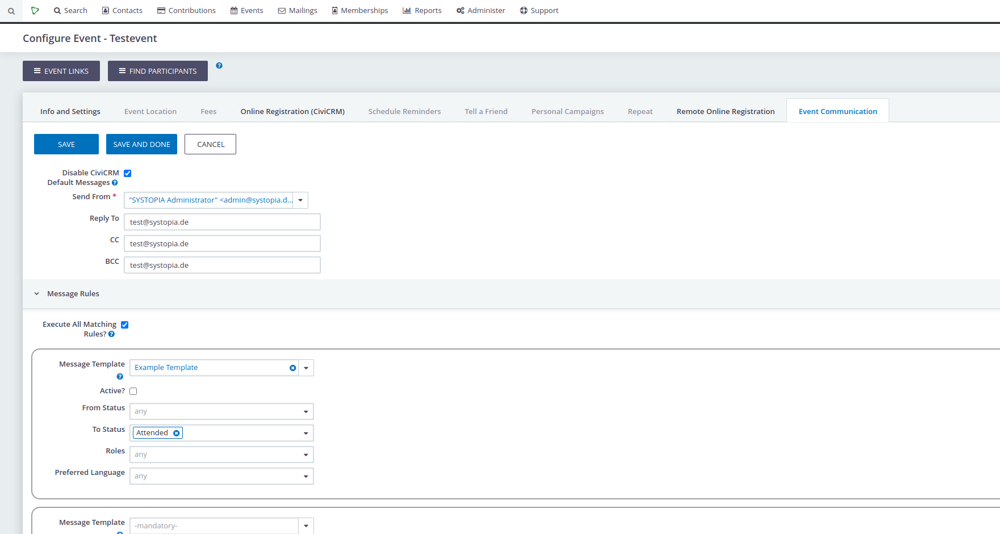

# Configurable Event Emails

## Scope

This extension provides an alternative way to send confirmation emails for CiviCRM Events. It creates an additional tab within CiviCRM Events that allows you to define different message templates to be sent based on conditions (including the participants status, role and preferred language). It will also allow you to suppress CiviCRM's regular emails.  

It aims at providing an easier way to adapt event confirmation mails than editing the system workflow messages provided by CiviCRM.

The extension is licensed under [AGPL-3.0](LICENSE.txt).

## Installation

This extension has not yet been published for installation via the web UI.

Sysadmins and developers can download the `.zip` file [HIER](https://github.com/systopia/de.systopia.eventmessages/releases), and unpack it in CiviCRM's extension folder. 
The extension can then be enabled in the user interface.

## Configuration

After installing and activating the extension a new tab "Event Communication" will be available in the event configuration UI. You can choose to disable all CiviEvent confirmation mails for the event at hand which is recomendended for most use cases.

Set your sender's cc, bcc and reply to addresses as desired and create at least one message rule. Message rules will use regular CiviCRM message templates so make sure to set up at least one template before defining rules.

If you tick the box "Execute All Matching Rules?" all matching rules will be executed, and potentially multiple emails will be sent to the same person. If this is disabled, the processing will stop after the first matching rule.

You should be able to use most contact token in the message templates. A list of additional token can be found under: /civiremote/civicrm/eventmessages/tokenlist

## Known Issues

This extension can send emails whenever an event registration is created or updated, including regular CiviEvent registration forms. You will be able to use many of CiviCRM's regular token as well as some special token provided by the extension. However some token and other data that can be found in CiviCRM's default confirmation mails wont work out of the box. This particularly affects payment information for events with online paymenst and/or partipant fees.

## Requirements

* PHP v7.0+
* CiviCRM 5.2.x
